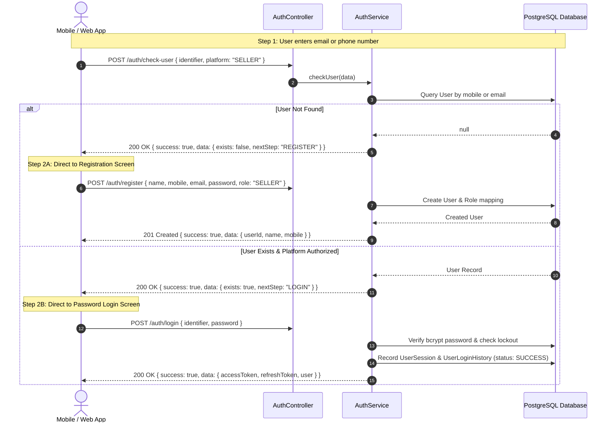
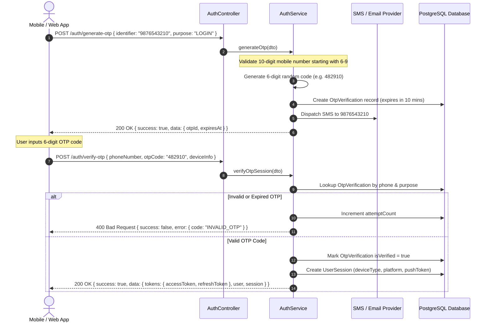
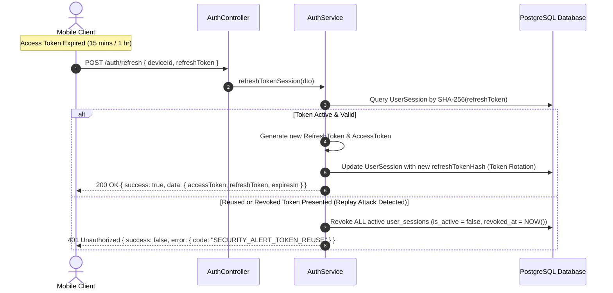
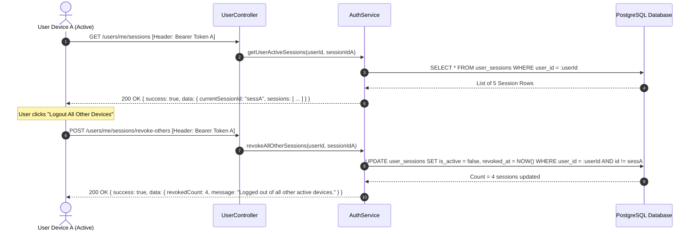

# Haatza Backend - Complete Authentication Flow & API Documentation

This document provides a comprehensive technical guide to the authentication lifecycle, security policies, database structures, and API specifications for the `Haatza-Seller-Backend` service.

---

## 📐 Table of Contents

1. [Overview & Unified Response Envelope](#1-overview--unified-response-envelope)
2. [Complete User Journey Diagrams](#2-complete-user-journey-diagrams)
   - [A. Check User & Registration / Login Flow](#a-check-user--registration--login-flow)
   - [B. OTP Generation & Verification Flow](#b-otp-generation--verification-flow)
   - [C. Token Refresh & Anti-Theft Rotation Flow](#c-token-refresh--anti-theft-rotation-flow)
   - [D. Multi-Device Session Management Flow](#d-multi-device-session-management-flow)
3. [API Specifications & Examples](#3-api-specifications--examples)
   - [1. Check User Existence (`POST /auth/check-user`)](#1-check-user-existence-post-authcheck-user)
   - [2. User Registration (`POST /auth/register`)](#2-user-registration-post-authregister)
   - [3. User Login (`POST /auth/login`)](#3-user-login-post-authlogin)
   - [4. Generate OTP (`POST /auth/generate-otp`)](#4-generate-otp-post-authgenerate-otp)
   - [5. Verify OTP (`POST /auth/verify-otp`)](#5-verify-otp-post-authverify-otp)
   - [6. Forgot Password (`POST /auth/forgot-password`)](#6-forgot-password-post-authforgot-password)
   - [7. Refresh Token / Session (`POST /auth/refresh`)](#7-refresh-token--session-post-authrefresh)
   - [8. Logout Single Session (`POST /auth/logout`)](#8-logout-single-session-post-authlogout)
   - [9. Get Active Sessions (`GET /users/me/sessions`)](#9-get-active-sessions-get-usersmesessions)
   - [10. Terminate Specific Session (`DELETE /users/me/sessions/:sessionId`)](#10-terminate-specific-session-delete-usersmesessionssessionid)
   - [11. Revoke All Other Devices (`POST /users/me/sessions/revoke-others`)](#11-revoke-all-other-devices-post-usersmesessionsrevoke-others)
4. [Database Table Schema & Security Rules](#4-database-table-schema--security-rules)

---

## 1. Overview & Unified Response Envelope

All API endpoints strictly follow the **Standard Unified Response Envelope**. Frontend web and mobile clients (iOS / Android) consume responses using a standardized format:

### Success Response Envelope (`HTTP 200 / 201`)
```json
{
  "success": true,
  "statusCode": 200,
  "message": "Operation description string",
  "data": {
    /* Payload object */
  },
  "error": null
}
```

### Error Response Envelope (`HTTP 400 / 401 / 403 / 404 / 500`)
```json
{
  "success": false,
  "statusCode": 400,
  "message": "Error description message",
  "data": null,
  "error": {
    "code": "ERROR_CODE_IDENTIFIER",
    "message": "Machine or user readable detail message",
    "details": {
      /* Optional extra details */
    }
  }
}
```

---

## 2. Complete User Journey Diagrams

### A. Check User & Registration / Login Flow



---

### B. OTP Generation & Verification Flow



---

### C. Token Refresh & Anti-Theft Rotation Flow



---

### D. Multi-Device Session Management Flow



---

## 3. API Specifications & Examples

### 1. Check User Existence (`POST /auth/check-user`)

Checks if a user exists by email or phone for a specific platform (`BUYER` or `SELLER`).

- **URL**: `/api/v1/auth/check-user` *(Alias: `/api/v1/auth/checkUser`)*
- **Method**: `POST`
- **Auth**: Public

#### Request Body:
```json
{
  "identifier": "9876543210",
  "platform": "SELLER"
}
```

#### Response (`200 OK` - User Exists):
```json
{
  "success": true,
  "statusCode": 200,
  "message": "User found.",
  "data": {
    "exists": true,
    "userId": "b0d405ad-5ff1-4e5e-b9b5-e13247cbfae3",
    "identifierType": "PHONE",
    "userType": "SELLER",
    "isActive": true,
    "emailVerified": true,
    "phoneVerified": true,
    "nextStep": "LOGIN"
  },
  "error": null
}
```

#### Response (`200 OK` - User Not Found):
```json
{
  "success": true,
  "statusCode": 200,
  "message": "User not found.",
  "data": {
    "exists": false,
    "userId": "",
    "identifierType": "PHONE",
    "userType": "",
    "isActive": false,
    "emailVerified": false,
    "phoneVerified": false,
    "nextStep": "REGISTER"
  },
  "error": null
}
```

---

### 2. User Registration (`POST /auth/register`)

Registers a new user on the platform.

- **URL**: `/api/v1/auth/register`
- **Method**: `POST`
- **Auth**: Public

#### Request Body:
```json
{
  "name": "Jane Doe",
  "mobile": "9876543210",
  "email": "jane.doe@example.com",
  "password": "SecurePassword123!",
  "role": "SELLER"
}
```

#### Response (`201 Created`):
```json
{
  "success": true,
  "statusCode": 201,
  "message": "Registration successful.",
  "data": {
    "userId": "usr_9b1deb4d-3b7d-4bad-9bdd-2b0d7b3dcb6d",
    "name": "Jane Doe",
    "mobile": "9876543210",
    "email": "jane.doe@example.com",
    "buyer": false
  },
  "error": null
}
```

---

### 3. User Login (`POST /auth/login`)

Authenticates user via email/mobile and password.

- **URL**: `/api/v1/auth/login` *(Alias: `/api/v1/auth/api/login`)*
- **Method**: `POST`
- **Auth**: Public

#### Request Body:
```json
{
  "identifier": "9876543210",
  "password": "SecurePassword123!"
}
```

#### Response (`200 OK`):
```json
{
  "success": true,
  "statusCode": 200,
  "message": "Login successful.",
  "data": {
    "accessToken": "eyJhbGciOiJIUzI1NiIsInR5cCI6IkpXVCJ9...",
    "refreshToken": "eyJhbGciOiJIUzI1NiIsInR5cCI6IkpXVCJ9...",
    "expiresIn": 3600,
    "user": {
      "id": "b0d405ad-5ff1-4e5e-b9b5-e13247cbfae3",
      "name": "Jane Doe",
      "email": "jane.doe@example.com",
      "phoneNumber": "9876543210",
      "role": "SELLER",
      "status": "ACTIVE"
    }
  },
  "error": null
}
```

---

### 4. Generate OTP (`POST /auth/generate-otp`)

Generates a 6-digit numeric OTP code. Validates 10-digit mobile numbers starting with 6–9.

- **URL**: `/api/v1/auth/generate-otp`
- **Method**: `POST`
- **Auth**: Public

#### Request Body:
```json
{
  "identifier": "9876543210",
  "purpose": "LOGIN",
  "channel": "SMS"
}
```

#### Response (`200 OK`):
```json
{
  "success": true,
  "statusCode": 200,
  "message": "OTP generated and sent successfully",
  "data": {
    "otpId": "3b2a1f0e-4d5c-6b7a-8f9e-0d1c2b3a4f5e",
    "expiresAt": "2026-08-07T19:15:00.000Z"
  },
  "error": null
}
```

#### Response (`400 Bad Request` - Invalid Mobile Length):
```json
{
  "statusCode": 400,
  "message": [
    "Identifier must be a valid email address or a valid 10-digit mobile number starting with 6-9."
  ],
  "error": "Bad Request"
}
```

---

### 5. Verify OTP (`POST /auth/verify-otp`)

Verifies 6-digit OTP code and creates mobile device session.

- **URL**: `/api/v1/auth/verify-otp`
- **Method**: `POST`
- **Auth**: Public

#### Request Body:
```json
{
  "phoneNumber": "9876543210",
  "otpCode": "482910",
  "deviceInfo": {
    "deviceId": "dev_iphone15_001",
    "deviceName": "iPhone 15 Pro",
    "platform": "iOS",
    "osVersion": "17.2",
    "appVersion": "1.0.0",
    "pushToken": "fcm_token_sample"
  }
}
```

#### Response (`200 OK`):
```json
{
  "success": true,
  "statusCode": 200,
  "message": "OTP verified successfully.",
  "data": {
    "tokens": {
      "accessToken": "eyJhbGciOiJIUzI1Ni...",
      "tokenType": "Bearer",
      "expiresIn": 900,
      "refreshToken": "7a6b5c4d3e2f1a0b9c8d7e6f5a4b3c2d"
    },
    "user": {
      "id": "b0d405ad-5ff1-4e5e-b9b5-e13247cbfae3",
      "name": "Jane Doe",
      "phoneNumber": "9876543210",
      "email": "jane.doe@example.com",
      "role": "seller",
      "status": "ACTIVE",
      "isBuyer": false,
      "isSeller": true
    },
    "session": {
      "sessionId": "sess_3b22d959",
      "deviceId": "dev_iphone15_001",
      "deviceType": "MOBILE",
      "platform": "iOS",
      "createdAt": "2026-08-07T19:00:00.000+05:30",
      "expiresAt": "2026-09-06T19:00:00.000+05:30"
    }
  },
  "error": null
}
```

#### Response (`400 Bad Request` - Invalid OTP Code):
```json
{
  "success": false,
  "statusCode": 400,
  "data": null,
  "error": {
    "code": "INVALID_OTP",
    "message": "The OTP entered is incorrect or has expired.",
    "details": {
      "attemptsRemaining": 2
    }
  }
}
```

---

### 6. Forgot Password (`POST /auth/forgot-password`)

Generates a password reset OTP.

- **URL**: `/api/v1/auth/forgot-password`
- **Method**: `POST`
- **Auth**: Public

#### Request Body:
```json
{
  "identifier": "9876543210"
}
```

#### Response (`200 OK`):
```json
{
  "success": true,
  "statusCode": 200,
  "message": "OTP generated and sent successfully",
  "data": {
    "otpId": "otp_reset_12345",
    "expiresAt": "2026-08-07T19:15:00.000Z"
  },
  "error": null
}
```

---

### 7. Refresh Token / Session (`POST /auth/refresh`)

Refreshes short-lived Access Token using Refresh Token with anti-theft token rotation.

- **URL**: `/api/v1/auth/refresh`
- **Method**: `POST`
- **Auth**: Public

#### Request Body:
```json
{
  "deviceId": "dev_iphone15_001",
  "refreshToken": "7a6b5c4d3e2f1a0b9c8d7e6f5a4b3c2d"
}
```

#### Response (`200 OK`):
```json
{
  "success": true,
  "statusCode": 200,
  "data": {
    "accessToken": "eyJhbGciOiJIUzI1Ni...",
    "expiresIn": 900,
    "tokenType": "Bearer",
    "refreshToken": "8b7c6d5e4f3a2b1c0d9e8f7a6b5c4d3e"
  },
  "error": null
}
```

#### Response (`401 Unauthorized` - Token Theft / Replay Attack):
```json
{
  "success": false,
  "statusCode": 401,
  "data": null,
  "error": {
    "code": "SECURITY_ALERT_TOKEN_REUSE",
    "message": "Session invalidated due to security breach attempt. Please log in again."
  }
}
```

---

### 8. Logout Single Session (`POST /auth/logout`)

Logs out user and invalidates the session refresh token.

- **URL**: `/api/v1/auth/logout`
- **Method**: `POST`
- **Auth**: Public

#### Request Body:
```json
{
  "refreshToken": "8b7c6d5e4f3a2b1c0d9e8f7a6b5c4d3e"
}
```

#### Response (`200 OK`):
```json
{
  "success": true,
  "statusCode": 200,
  "message": "Logged out successfully",
  "data": null,
  "error": null
}
```

---

### 9. Get Active Sessions (`GET /users/me/sessions`)

Lists all active and past device sessions for the authenticated user.

- **URL**: `/api/v1/users/me/sessions` *(Alias: `/api/v1/user/me/sessions`)*
- **Method**: `GET`
- **Auth**: Bearer Access Token Required

#### Response (`200 OK`):
```json
{
  "success": true,
  "statusCode": 200,
  "data": {
    "currentSessionId": "3b22d959-f7f7-445d-bad1-29b5ca7b9aed",
    "sessions": [
      {
        "sessionId": "3b22d959-f7f7-445d-bad1-29b5ca7b9aed",
        "deviceId": "dev_3b22d959",
        "deviceName": "Postman App",
        "platform": "WEB",
        "deviceType": "WEB",
        "ipAddress": "115.99.185.20",
        "identifier": "9876543210",
        "isCurrentDevice": true,
        "isActive": true,
        "lastActiveAt": "2026-08-07T18:38:33.419+05:30",
        "createdAt": "2026-08-07T18:38:33.419+05:30"
      }
    ]
  },
  "error": null
}
```

---

### 10. Terminate Specific Session (`DELETE /users/me/sessions/:sessionId`)

Terminates a specific device session using its `sessionId`.

- **URL**: `/api/v1/users/me/sessions/9d82f611-1a15-4fa7-89ce-cfe21364c554`
- **Method**: `DELETE`
- **Auth**: Bearer Access Token Required

#### Response (`200 OK`):
```json
{
  "success": true,
  "statusCode": 200,
  "data": {
    "revokedSessionId": "9d82f611-1a15-4fa7-89ce-cfe21364c554",
    "message": "Device session successfully terminated."
  },
  "error": null
}
```

---

### 11. Revoke All Other Devices (`POST /users/me/sessions/revoke-others`)

Terminates all active device sessions except the current active session.

- **URL**: `/api/v1/users/me/sessions/revoke-others`
- **Method**: `POST`
- **Auth**: Bearer Access Token Required

#### Response (`200 OK`):
```json
{
  "success": true,
  "statusCode": 200,
  "data": {
    "revokedCount": 4,
    "message": "Logged out of all other active devices."
  },
  "error": null
}
```

---

## 4. Database Table Schema & Security Rules

### A. Table Mapping Matrix

| Feature | PostgreSQL Table Name | Key Columns |
|---|---|---|
| Registered Accounts | `users` | `user_id`, `email`, `phone`, `password_hash`, `failed_login_attempts`, `locked_until`, `last_login_at` |
| Device Sessions | `user_sessions` | `session_id`, `user_id`, `refresh_token_hash`, `refresh_token`, `device_id`, `device_name`, `platform`, `is_active`, `revoked_at` |
| OTP Codes | `otp_verifications` | `otp_id`, `user_id`, `identifier`, `otp_hash`, `purpose`, `is_verified`, `attempt_count`, `expires_at` |
| Audit Trail | `user_login_histories` | `login_id`, `user_id`, `identifier`, `status` (`SUCCESS`/`FAILED`), `ip_address`, `user_agent`, `failure_reason` |

### B. Core Security Policies

1. **Password Hashing**: Passwords stored using bcrypt with cost factor 10.
2. **Account Lockout**: 5 consecutive invalid password attempts automatically locks the account for 15 minutes (`lockedUntil`). Successful login resets `failed_login_attempts` to `0`.
3. **Session Theft Protection**: Re-using a previously rotated refresh token triggers `SECURITY_ALERT_TOKEN_REUSE` and automatically revokes all active sessions for that `user_id`.
4. **OTP Security**: OTP codes expire in 10 minutes. Maximum 3 verification attempts allowed before blocking.
